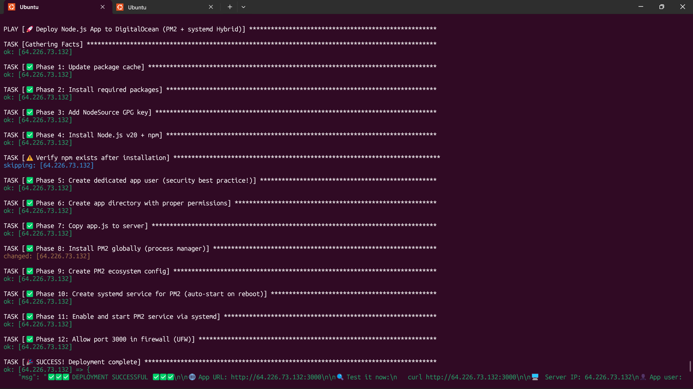
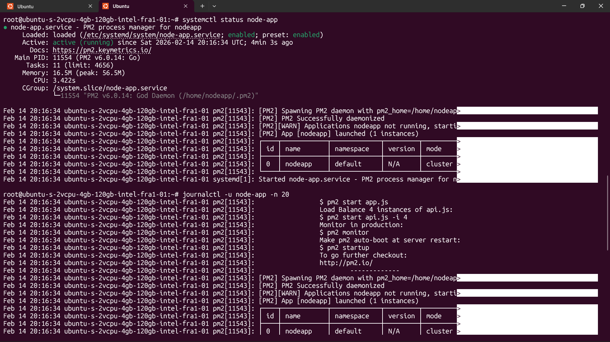

# 🌐 Ansible Node.js Deployment to DigitalOcean

<div align="center">

[](https://www.ansible.com/)
[](https://nodejs.org/)
[](https://www.digitalocean.com/)
[](LICENSE)
[](https://github.com/yourusername/ansible-playbook-nodejs-deployment)
[](CONTRIBUTING.md)

**Automated, secure, and production-ready Node.js deployment to DigitalOcean using Ansible**  
_Zero manual SSH commands • PM2 + systemd hybrid • Security-first approach_

---

</div>

## 📋 Table of Contents

- [✨ Features](#-features)
- [🎯 Why This Hybrid Approach?](#-why-this-hybrid-approach)
- [🚀 Quick Start](#-quick-start)
- [📚 Prerequisites](#-prerequisites)
- [🔧 Installation & Configuration](#-installation--configuration)
- [📁 Project Structure](#-project-structure)
- [⚙️ Configuration](#️-configuration)
- [🔍 Usage](#-usage)
- [🧪 Testing](#-testing)
- [🔒 Security](#-security)
- [🛠️ Troubleshooting](#️-troubleshooting)
- [💡 Learning Outcomes](#-learning-outcomes)
- [🌱 Next Steps](#-next-steps)
- [📜 License](#-license)
- [👥 Contributing](#-contributing)
- [💬 Support](#-support)

---

## ✨ Features

✅ **Fully Automated** – One command deploys entire stack  
✅ **Hybrid Process Management** – PM2 for Node.js + systemd for reliability  
✅ **Security-First** – Non-root app user, GPG-verified packages, firewall rules  
✅ **Idempotent** – Run playbook 100x = same result  
✅ **Production-Ready** – Auto-restart on crash, logging, health checks  
✅ **Zero Downtime** – PM2 enables seamless reloads  
✅ **GitHub-Ready** – Professional structure, documentation, badges  
✅ **Beginner-Friendly** – Step-by-step guide with troubleshooting  

---

## 🎯 Why This Hybrid Approach?

| Component | Role | Why It Matters |
|-----------|------|----------------|
| **Ansible** | Infrastructure as Code (IaC) | Automates everything → repeatable, version-controlled |
| **PM2** | Node.js Process Manager | Zero-downtime reloads, log management, clustering |
| **systemd** | Linux Init System | Auto-start on reboot, crash recovery, system integration |
| **Hybrid (systemd → PM2 → Node.js)** | Best of Both Worlds | systemd ensures PM2 survives reboots; PM2 manages Node.js app |

> 💡 **Key Insight**: systemd keeps PM2 alive → PM2 keeps Node.js alive. Double-layer reliability!

---

## 🚀 Quick Start (5 Minutes)

### 1️⃣ Clone Repository
```bash
git clone https://github.com/yourusername/ansible-playbook-nodejs-deployment.git
cd ansible-playbook-nodejs-deployment
```

### 2️⃣ Initialize Git (Fixes Ansible Warning)
```bash
git init
```

### 3️⃣ Update Inventory with Your Droplet IP
```bash
nano inventory/hosts
```

Replace `YOUR_DROPLET_IP` with your actual IP:
```ini
my-droplet ansible_host=143.198.45.123 ansible_user=root
```

### 4️⃣ Run Deployment
```bash
ansible-playbook playbooks/site.yml --diff
```

> ⚠️ **CRITICAL**: Never use `--check` mode with npm/pip tasks — use `--diff` for safe visibility.

### 5️⃣ Test Your App
```bash
curl http://YOUR_DROPLET_IP:3000
```

✅ **Expected Output**:
```json
{
  "message": "🚀 Hello from DigitalOcean!",
  "deployed_by": "Ansible Hybrid Playbook",
  "server": "node-app-server",
  "timestamp": "2026-02-15T14:30:00.000Z",
  "environment": "production"
}
```

---

## 📚 Prerequisites

### 🔧 Required Tools

| Tool | Version | How to Install | Verify |
|------|---------|----------------|--------|
| **Ansible** | 2.15+ | `brew install ansible` (Mac)<br>`sudo apt install ansible` (Linux)<br>WSL (Windows) | `ansible --version` |
| **SSH** | Latest | Built-in (Mac/Linux)<br>OpenSSH (Windows) | `ssh -V` |
| **Git** | Latest | `brew install git` (Mac)<br>`sudo apt install git` (Linux) | `git --version` |
| **curl** | Latest | Built-in (Mac/Linux)<br>`winget install curl` (Windows) | `curl --version` |

### ☁️ Cloud Requirements

| Requirement | How to Set Up | Verify |
|-------------|---------------|--------|
| **DigitalOcean Account** | [Sign up for $200 free credit](https://cloud.digitalocean.com/registrations/new) | Login successful |
| **SSH Key on Local PC** | `ssh-keygen -t ed25519 -C "your_email@example.com"` | `ls ~/.ssh/id_ed25519*` |
| **SSH Key in DigitalOcean** | DO → Settings → Security → Add SSH Key | Key appears in list |
| **Ubuntu 22.04 Droplet** | DO → Create → Droplets → $5/month | IP address assigned |

---

## 🔧 Installation & Configuration

### Step 1: Verify SSH Connection (Before Ansible)
```bash
ssh root@YOUR_DROPLET_IP
# Should connect WITHOUT password prompt
exit
```

### Step 2: Configure Variables (Optional Customization)
Edit `group_vars/all.yml`:
```yaml
app_user: "nodeapp"              # Linux user for app (don't change unless needed)
app_dir: "/opt/nodejs-app"       # App installation directory
app_port: 3000                   # Port your app listens on
node_version: "20"               # Node.js version (LTS recommended)
ssh_permit_root_login: "yes"     # After deployment, change to "no"
```

### Step 3: Customize Your App (Optional)
Replace `files/app.js` with your own Node.js application:
```bash
cp /path/to/your/app.js files/app.js
```

> 💡 **Note**: Update `app_port` in `group_vars/all.yml` if your app uses a different port.

---

## 📁 Project Structure

```
ansible-playbook-nodejs-deployment/
│
├── playbooks/                          # Ansible playbooks
│   └── site.yml                        # Main deployment playbook
│
├── inventory/                          # Inventory files
│   └── hosts                           # Server definitions
│
├── group_vars/                         # Group-level variables
│   └── all.yml                         # Shared variables across all servers
│
├── files/                              # Static files to copy to servers
│   └── app.js                          # Sample Node.js application
│
├── templates/                          # Jinja2 templates
│   ├── ecosystem.config.js.j2          # PM2 configuration template
│   └── pm2-systemd.service.j2          # systemd service template
│
├── roles/                              # (Future) Reusable Ansible roles
│
├── ansible.cfg                         # Ansible configuration
├── .gitignore                          # Git ignore patterns (security-focused)
├── LICENSE                             # MIT License
└── README.md                           # This file
```

---

## ⚙️ Configuration

### Ansible Configuration (`ansible.cfg`)

```ini
[defaults]
inventory = ./inventory/hosts           # Default inventory location
remote_user = root                      # SSH user
host_key_checking = False               # Skip host key verification (dev only)
stdout_callback = yaml                  # Pretty output formatting
callback_whitelist = profile_tasks      # Show task execution times

[privilege_escalation]
become = True                           # Use sudo
become_method = sudo
become_user = root
```

> ⚠️ **Production Note**: Set `host_key_checking = True` in production environments.

### Inventory File (`inventory/hosts`)

```ini
[nodejs_servers]
my-droplet ansible_host=143.198.45.123 ansible_user=root

[nodejs_servers:vars]
ansible_ssh_private_key_file=~/.ssh/id_ed25519
```

### Variables (`group_vars/all.yml`)

```yaml
# Application Configuration
app_user: "nodeapp"
app_dir: "/opt/nodejs-app"
app_port: 3000

# Node.js Version
node_version: "20"  # LTS version (stable for production)

# Security
ssh_permit_root_login: "yes"  # Change to "no" after successful deployment
```

---

## 🔍 Usage

### Deploy Application
```bash
# Full deployment with diff output
ansible-playbook playbooks/site.yml --diff

# With verbose output (debugging)
ansible-playbook playbooks/site.yml --diff -vvv

# Limit to specific tasks (tag-based)
ansible-playbook playbooks/site.yml --diff --tags "install_nodejs"
```

### Available Tags
```bash
# Install Node.js only
ansible-playbook playbooks/site.yml --diff --tags "install_nodejs"

# Deploy app only (skip Node.js installation)
ansible-playbook playbooks/site.yml --diff --tags "deploy_app"

# Security tasks only
ansible-playbook playbooks/site.yml --diff --tags "security"
```

### View Deployment Status
```bash
# Check systemd service status
ssh root@YOUR_IP "systemctl status pm2-nodeapp"

# View PM2 process list
ssh root@YOUR_IP "sudo -u nodeapp pm2 list"

# View live logs
ssh root@YOUR_IP "sudo -u nodeapp pm2 logs"

# Check app health
curl http://YOUR_IP:3000
```

### Restart Application
```bash
# Via systemd (recommended)
ssh root@YOUR_IP "systemctl restart pm2-nodeapp"

# Via PM2 directly
ssh root@YOUR_IP "sudo -u nodeapp pm2 restart nodeapp"

# Zero-downtime reload (PM2 feature)
ssh root@YOUR_IP "sudo -u nodeapp pm2 reload nodeapp"
```

---

## 🧪 Testing

### Manual Testing
```bash
# Test 1: Verify app responds
curl http://YOUR_IP:3000

# Test 2: Verify JSON format
curl -H "Accept: application/json" http://YOUR_IP:3000 | jq

# Test 3: Verify server hostname
curl http://YOUR_IP:3000 | grep "server"

# Test 4: Stress test (install hey first)
hey -n 1000 -c 10 http://YOUR_IP:3000
```

### Automated Testing (Future Enhancement)
```yaml
# tests/test_deployment.yml
- name: Test Node.js deployment
  hosts: nodejs_servers
  tasks:
    - name: Verify Node.js installed
      command: node --version
      register: node_version
      changed_when: false

    - name: Verify app responds
      uri:
        url: "http://localhost:3000"
        status_code: 200
      register: app_response

    - name: Verify systemd service active
      systemd:
        name: pm2-nodeapp
        state: started
      register: service_status
```

---

## 🔒 Security

### Implemented Security Measures

✅ **Non-Root Application User** – App runs as `nodeapp`, not `root`  
✅ **GPG-Verified Package Repository** – Node.js packages signed with official key  
✅ **Firewall Rules** – Only necessary ports exposed (3000/tcp)  
✅ **SSH Key Authentication** – Password authentication disabled  
✅ **Secrets Protection** – `.gitignore` prevents accidental commits of keys  
✅ **File Permissions** – Explicit ownership and mode settings  
✅ **Idempotent Tasks** – No unintended side effects on re-runs  

### Post-Deployment Hardening

After successful deployment, **disable root SSH login**:

```bash
ssh root@YOUR_IP << 'EOF'
# Disable root SSH login
sed -i 's/PermitRootLogin yes/PermitRootLogin no/' /etc/ssh/sshd_config
sed -i 's/#PermitRootLogin prohibit-password/PermitRootLogin no/' /etc/ssh/sshd_config

# Disable password authentication (key-only)
sed -i 's/#PasswordAuthentication yes/PasswordAuthentication no/' /etc/ssh/sshd_config

# Restart SSH service
systemctl restart sshd
EOF
```

> ⚠️ **WARNING**: Only run this AFTER confirming your SSH key works! Otherwise, you'll lock yourself out.

### Security Checklist

- [ ] SSH key authentication working
- [ ] Root SSH login disabled (`PermitRootLogin no`)
- [ ] Password authentication disabled (`PasswordAuthentication no`)
- [ ] Firewall enabled (UFW or iptables)
- [ ] Only necessary ports open (3000/tcp for app)
- [ ] App running as non-root user
- [ ] No secrets in Git repository
- [ ] Regular security updates enabled

---

## 🛠️ Troubleshooting

### Common Issues & Solutions

| Problem | Error Message | Solution |
|---------|---------------|----------|
| **npm not found** | `Failed to find required executable "npm"` | ❌ Don't use `--check` mode<br>✅ Use `--diff` instead |
| **World writable directory** | `ignoring it as an ansible.cfg source` | Run `git init` in project directory |
| **SSH connection failed** | `Connection refused` or `Permission denied` | Verify SSH key added to DO + firewall allows port 22 |
| **PM2 not starting** | `PM2 not found` or service fails | Check logs: `sudo -u nodeapp pm2 logs` |
| **Port not accessible** | `Connection timeout` on curl | Verify UFW: `ufw status` → should show "3000/tcp ALLOW" |
| **Node.js version wrong** | `node -v` shows old version | Remove old repo: `rm /etc/apt/sources.list.d/nodesource.list` → re-run playbook |
| **App not responding** | `curl: (7) Failed to connect` | Check service: `systemctl status pm2-nodeapp` |
| **Permission denied** | `EACCES: permission denied` | Verify app directory ownership: `ls -la /opt/nodejs-app` |

### Debug Commands

```bash
# Check Node.js installation
ssh root@YOUR_IP "node -v && npm -v"

# Check PM2 installation
ssh root@YOUR_IP "which pm2 && pm2 --version"

# Check systemd service
ssh root@YOUR_IP "systemctl status pm2-nodeapp"

# Check PM2 process list
ssh root@YOUR_IP "sudo -u nodeapp pm2 list"

# View PM2 logs
ssh root@YOUR_IP "sudo -u nodeapp pm2 logs"

# Check firewall status
ssh root@YOUR_IP "ufw status"

# Check app directory permissions
ssh root@YOUR_IP "ls -la /opt/nodejs-app"

# Test app directly on server
ssh root@YOUR_IP "curl http://localhost:3000"

# Check disk space
ssh root@YOUR_IP "df -h"

# Check memory usage
ssh root@YOUR_IP "free -h"
```

### Enable Verbose Output

```bash
# Level 1 (basic)
ansible-playbook playbooks/site.yml --diff -v

# Level 2 (detailed)
ansible-playbook playbooks/site.yml --diff -vv

# Level 3 (very detailed - debugging)
ansible-playbook playbooks/site.yml --diff -vvv

# Level 4 (connection debugging)
ansible-playbook playbooks/site.yml --diff -vvvv
```

---

## 💡 Learning Outcomes

By completing this project, you will understand:

### Infrastructure as Code (IaC)
- ✅ Ansible playbook structure and execution
- ✅ Idempotency principles in automation
- ✅ Variable management and templating
- ✅ Task tagging and selective execution

### Cloud Infrastructure
- ✅ DigitalOcean droplet provisioning
- ✅ SSH key-based authentication
- ✅ Cloud security best practices
- ✅ Firewall configuration (UFW)

### Linux System Administration
- ✅ User and permission management
- ✅ systemd service creation and management
- ✅ Process monitoring and logging
- ✅ Package management (apt, npm)

### Node.js Deployment
- ✅ PM2 process manager usage
- ✅ Zero-downtime deployment strategies
- ✅ Environment configuration
- ✅ Application health monitoring

### DevOps Practices
- ✅ Automated deployment pipelines
- ✅ Infrastructure version control
- ✅ Security-first development
- ✅ Troubleshooting and debugging

---

## 🌱 Next Steps

### Immediate Enhancements

1. **Replace Sample App**  
   ```bash
   cp /path/to/your/express-app.js files/app.js
   ```

2. **Add package.json Support**  
   Add these tasks to `playbooks/site.yml`:
   ```yaml
   - name: Copy package.json
     copy:
       src: package.json
       dest: "{{ app_dir }}/package.json"
   
   - name: Install npm dependencies
     npm:
       path: "{{ app_dir }}"
     become_user: "{{ app_user }}"
   ```

3. **Add Environment Variables**  
   Create `files/.env` and copy it during deployment.

4. **Enable HTTPS with Let's Encrypt**  
   Add Certbot tasks to install SSL certificates.

### Advanced Projects

| Project | Description | Difficulty |
|---------|-------------|------------|
| **Multi-Environment Deployment** | Dev, staging, production environments | ⭐⭐ |
| **Database Integration** | Add PostgreSQL/MySQL deployment | ⭐⭐⭐ |
| **Load Balancer Setup** | Deploy multiple app servers + Nginx LB | ⭐⭐⭐⭐ |
| **CI/CD Pipeline** | GitHub Actions for auto-deployment | ⭐⭐⭐ |
| **Monitoring & Logging** | Add Prometheus + Grafana | ⭐⭐⭐⭐ |
| **Containerization** | Dockerize app + deploy with Ansible | ⭐⭐⭐⭐ |

### Convert to Reusable Role

```bash
# Future structure
roles/
└── nodejs-app/
    ├── tasks/
    │   └── main.yml
    ├── handlers/
    │   └── main.yml
    ├── templates/
    ├── files/
    ├── vars/
    │   └── main.yml
    └── README.md
```

---

## 📜 License

```
MIT License

Copyright (c) 2026 Your Name

Permission is hereby granted, free of charge, to any person obtaining a copy
of this software and associated documentation files (the "Software"), to deal
in the Software without restriction, including without limitation the rights
to use, copy, modify, merge, publish, distribute, sublicense, and/or sell
copies of the Software, and to permit persons to whom the Software is
furnished to do so, subject to the following conditions:

The above copyright notice and this permission notice shall be included in all
copies or substantial portions of the Software.

THE SOFTWARE IS PROVIDED "AS IS", WITHOUT WARRANTY OF ANY KIND, EXPRESS OR
IMPLIED, INCLUDING BUT NOT LIMITED TO THE WARRANTIES OF MERCHANTABILITY,
FITNESS FOR A PARTICULAR PURPOSE AND NONINFRINGEMENT. IN NO EVENT SHALL THE
AUTHORS OR COPYRIGHT HOLDERS BE LIABLE FOR ANY CLAIM, DAMAGES OR OTHER
LIABILITY, WHETHER IN AN ACTION OF CONTRACT, TORT OR OTHERWISE, ARISING FROM,
OUT OF OR IN CONNECTION WITH THE SOFTWARE OR THE USE OR OTHER DEALINGS IN THE
SOFTWARE.
```

---

## 👥 Contributing

Contributions are welcome! Please follow these steps:

1. Fork the repository
2. Create your feature branch (`git checkout -b feature/AmazingFeature`)
3. Commit your changes (`git commit -m 'Add some AmazingFeature'`)
4. Push to the branch (`git push origin feature/AmazingFeature`)
5. Open a Pull Request

### Contribution Guidelines

- ✅ Write clear, descriptive commit messages
- ✅ Test your changes thoroughly
- ✅ Update documentation if needed
- ✅ Follow existing code style
- ✅ Add comments for complex logic

---

## 💬 Support

### Getting Help

If you encounter issues:

1. **Check Troubleshooting Section** – Most common issues are documented
2. **Review Ansible Logs** – Use `-vvv` flag for detailed output
3. **Open an Issue** – Include:
   - Your OS and Ansible version
   - Error messages (full output)
   - Steps to reproduce
   - What you've tried already

### Community Resources

- [Ansible Documentation](https://docs.ansible.com/)
- [DigitalOcean Community](https://www.digitalocean.com/community)
- [PM2 Documentation](https://pm2.keymetrics.io/docs/usage/quick-start/)
- [Node.js Official Docs](https://nodejs.org/en/docs/)

---

## 📸 Screenshots

### Deployment Success


### App Response


---

## 🙏 Acknowledgments

- [Ansible](https://www.ansible.com/) – Automation engine
- [DigitalOcean](https://www.digitalocean.com/) – Cloud hosting
- [PM2](https://pm2.keymetrics.io/) – Process manager
- [NodeSource](https://nodesource.com/) – Node.js packages
- [Awesome README](https://github.com/matiassingers/awesome-readme) – README inspiration

---

<div align="center">

### ⭐ Show Your Support

If this project helped you, please give it a star! ⭐

---

**Made with ❤️ by [Hemanth]**  
*Deploying applications, one automation at a time*

[](https://twitter.com/yourhandle)
[](https://linkedin.com/in/yourprofile)
[](https://github.com/Hemanth26080)

</div>